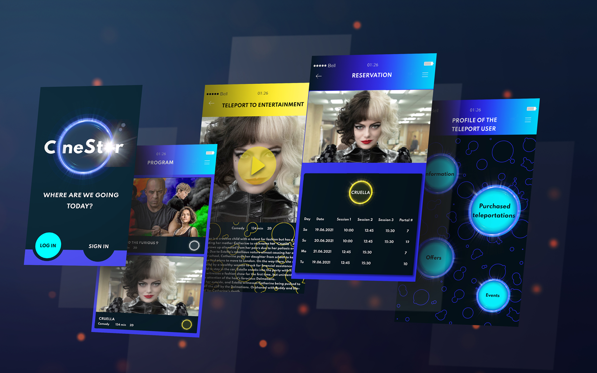
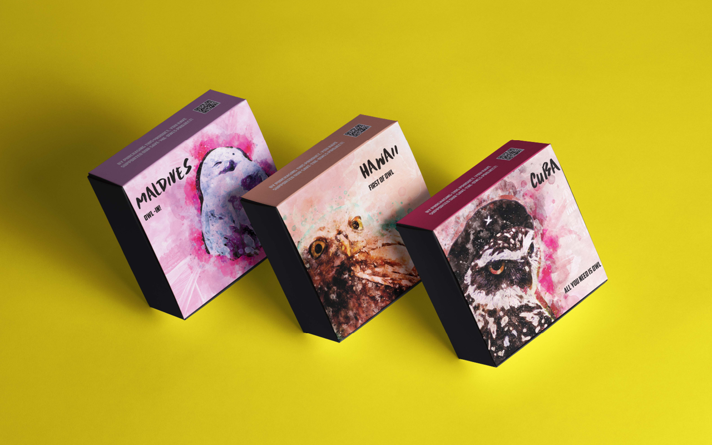
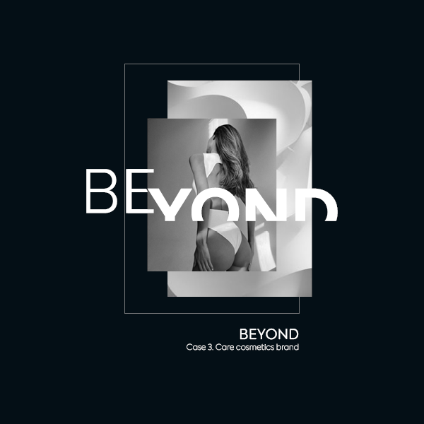

# First Impression

## Hi, I′m Anastasiia!
My feature is to give you a living brand, not just a logo.

In my work, I like to combine design, marketing, psychology and neuroscience. Each brand is a living entity, with its own character, features, voice, and behavior.
I think this approach is also connected with my love for fantasy and fictional worlds, science fiction, and cinema.

## Featured Projects

### Case 1. CineStar, Cinema rebranding (school project).

OBJECTIVE:
- unify heterogeneous corporate identity;
- brand modernization;
- improving the perception of brand prestige.

KEY TO CRACK:
- exploiting the potential of existing unique interiors (the most expensive part in case of rebranding);
- archetype Magician.

### Case 2. Gray Owl, Gel polish brand.

OBJECTIVE:
- brand of gel polishes specifically for marketplaces;
- must be able to compete in price and at the same time arouse interest among a huge number of offers;
- sale in sets (specificity of the place of sale).

KEY TO CRACK:
- atypical brightness;
- more personal and informal communication.

### Case 3. Beyond, Care cosmetics brand.

OBJECTIVE:
- sexy and slightly provocative vibe;
- fragrance is in the spotlight;
- bathroom products for women;
- also need a name.

KEY TO CRACK:
- activation of personal inner sexuality;
- five senses;
- me-communication from the brand.

________
- [View Presentation to find out more](images/featured-projects-2022_.pdf)
