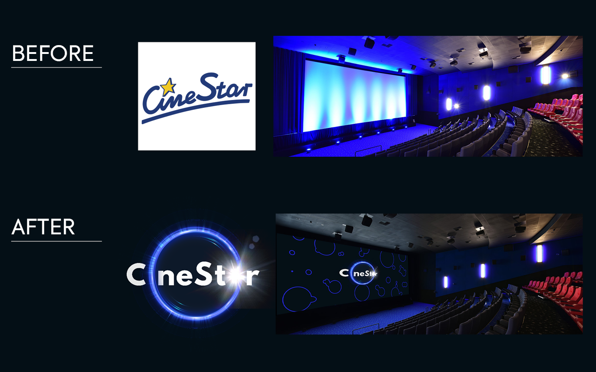

# #01. Rebranding of the cinema CineStar

- [Brief context](#brief-context)
- [Objectives](#objectives)
- [Key to crack](#key-to-crack)
- [Process and Outcomes](#process-and-outcomes)
- [Team and my role](#team-and-my-role)
- [Dates](#dates)
- [Deadlines](#deadlines)
- [Takeaways](#takeaways)

## Brief context
CineStar is a cinema company based in Lübeck, Germany. 
The company was founded in 1948, and is the largest cinema chain in Germany (54 locations) and Croatia (14). Also it has multiplexes in Czech Republic, Bosnia and Herzegovina, and Serbia.

One of its branches is located in Prague 5 next to my apartment. Every day at least twice I pass by him, and several times I went to sessions. I like the interior and the halls, but the corporate style could be more modern and stylish, in my opinion. Thus, I chose the cinema CineStar as the object for the student rebranding project. 

## Objectives
During the research, I found out that logos in countries differ from the main one, and not because of localization. So, first of all, the purpose of this project was to unify and modernize the corporate identity. As a consequence, a new visual style could increase audience interest and attract new customers.

**In a nutshell:**
- unify heterogeneous corporate identity,
- brand modernization,
- improving brand prestige.

## Key to crack
The most expensive and difficult-to-change part of the rebranding is changing in repair, interior, and exterior (if applicable to the company).
Thus, first of all, I paid attention to the interior — how does it look now?, what mood does it create?, what message does it carry? Is it possible to put in place the idea of a new concept with minimal intervention in the interior?

And it should be said that this part is the strength of the current style of the cinema. It has an incredible interior, space corridors, and good spacious halls.

This was the starting point in thinking about the concept of a new visual style.

After a certain number of iterations, an image emerged. The words that inspired me were: imagination, intrigue, transformation, irrationality.
The general atmosphere fits well with the Magician Archetype.

The Magician Archetype makes dreams come true by using knowledge of how the world works. Magician brands are transformative. 
When it comes to the motivation of the Magician, these brands want to make your dreams come to life and create something special and informative. They want to bring the future to the present. The goal of this type is to help people transform their world, improving one’s life and making things exciting.

This is exactly what is suitable for cinema! Especially with such interesting premises as CineStar has!

**In a nutshell:**
- using the potential of existing unique interiors (the most expensive part of rebranding),
- the Magician Archetype.

## Process and Outcomes
The thoughts above led to the concept of Teleport.

I have choosen primary color — right blue, as a symbol of "mysticism". This creates a strange, inexpressible effect, as if pulling the observer along with it. 
Secondary colors define the film's genres.

In line with this idea, examples of visual communication have been designed.

Mobile application instead of a customer card.

The interface changes depending on the genre of the most watched movies (from the history of purchased tickets).

Here is a visual of web site and social media.

If there are halls in other cinemas, there are portals in CineStar!

Before and After...

## Team and my role
It was a solo project.

## Dates
April, 2021.

## Deadlines
One week was given to complete the project.

## Takeaways
This project was a great opportunity to learn more about rebranding. The changes don't have to be big to keep the brand recognizable. But we must move the design towards the chosen concept.
