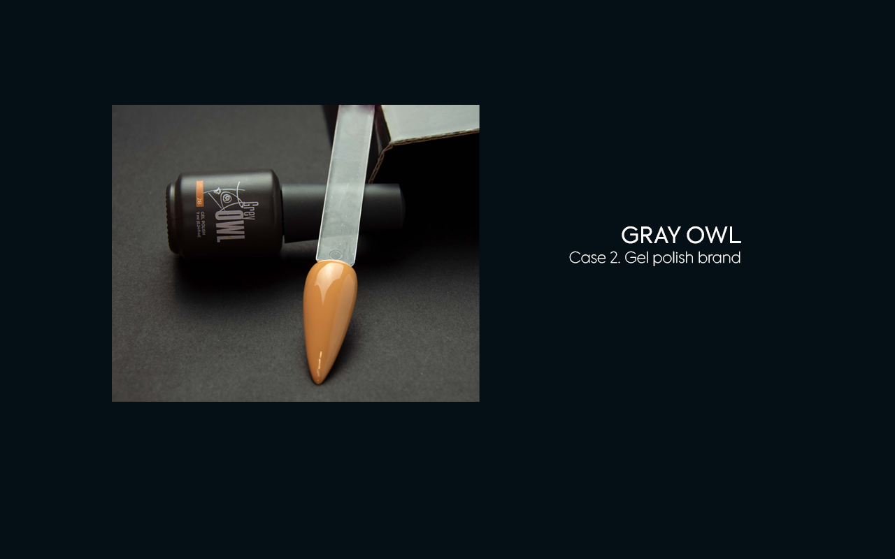
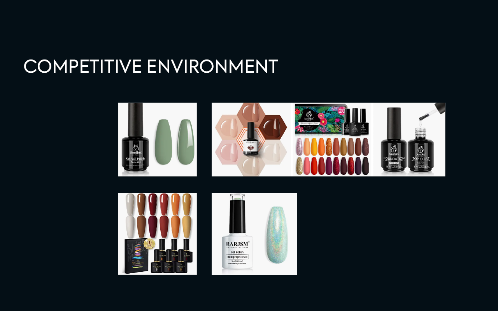
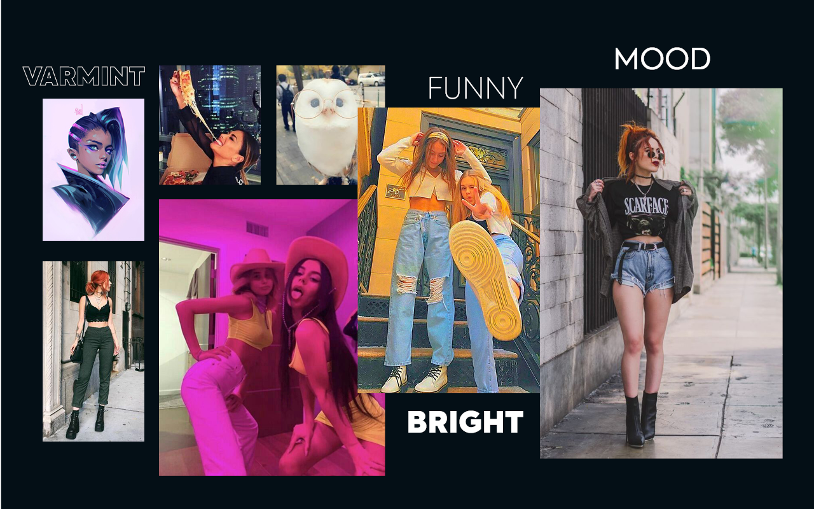
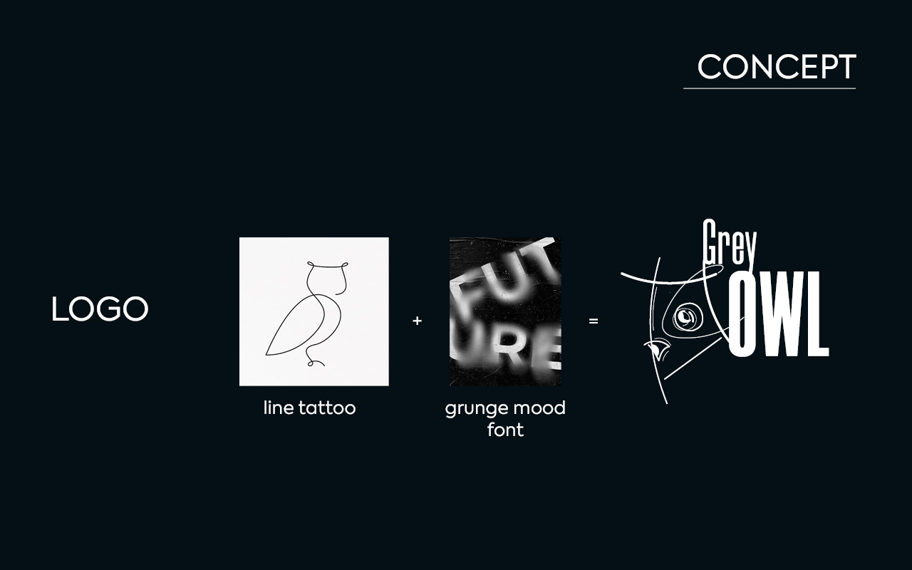
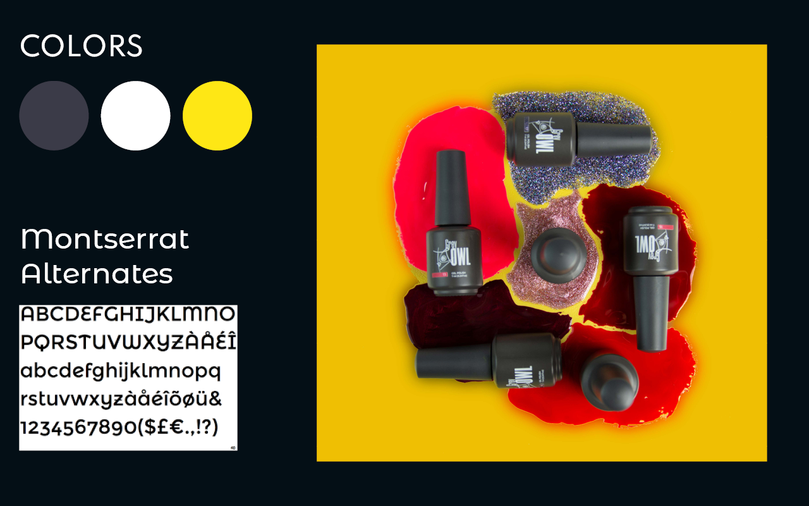
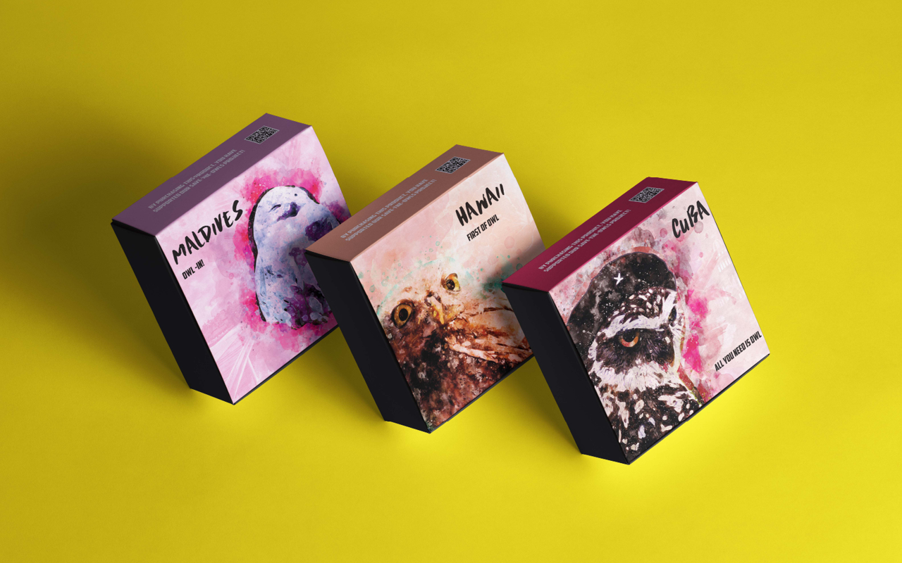
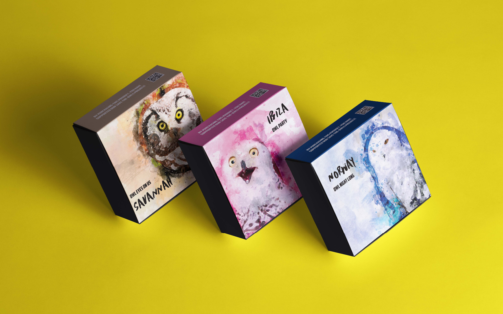
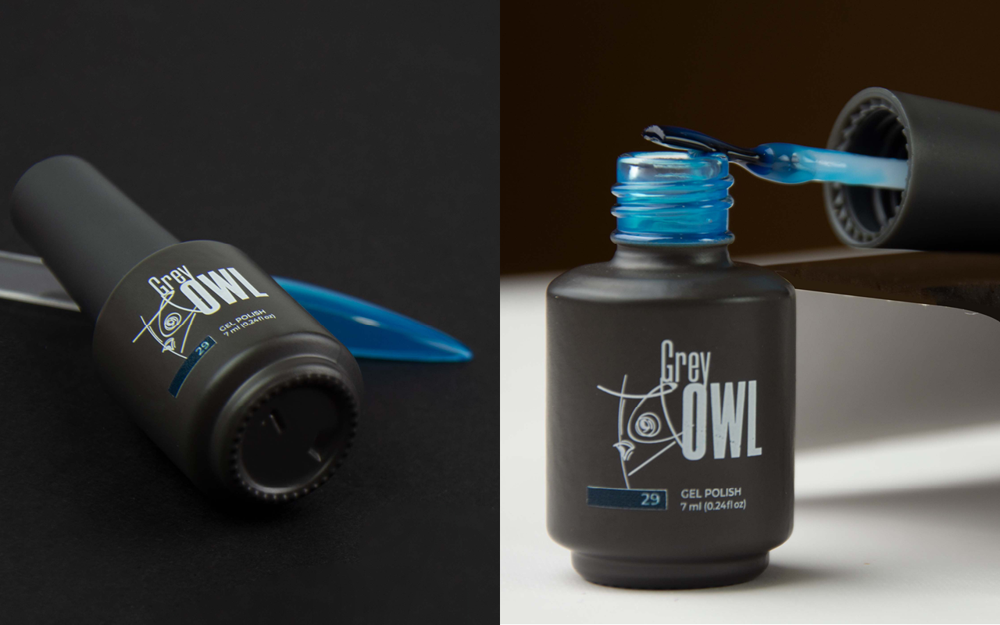

# #02. GRAY OWL, gel polish brand

- [Brief context](#brief-context)
- [Objectives](#objectives)
- [Key to crack](#key-to-crack)
- [Process and Outcomes](#process-and-outcomes)
- [Team and my role](#team-and-my-role)
- [Dates](#dates)
- [Deadlines](#deadlines)
- [Takeaways](#takeaways)

## Brief context
The company sells gel polishes and other manicure products. It uses a distribution network as its main sales channel. To increase sales, the marketing team wanted to use marketplaces. But that would be contrary to the contracts they have with their partners.

Thus, the team decided to create a completely different brand that has in common with the main one. This project implies a special format of products intended for sale only on marketplaces.

## Objectives
The specifics of marketplaces are keeping a lower price level. And, if we are talking about the nail industry, selling in sets.
The general appearance and packaging should compare favorably with the existing offer. In short, look more expensive but be cheaper.

**In a nutshell:**
- a brand of gel polishes for marketplaces,
- must be able to compete on price and at the same time arouse interest among a huge number of offers,
- sale in sets.

## Key to crack
Based on the above follows a solution tending to atypical brightness.
It is also important to think about communication. It should attract the attention of a potential customer. It should encourage them to show interest in the product.

**In a nutshell:**
- atypical brightness
-  more informal communication.

## Process and Outcomes

The concept for this project became funny, a little cheeky mood. To express it in a logo, I have chosen a line tattoo style and grunge mood font.

The main colors are gray (according to the brand name) and vivid yellow, which contrasts well with the first.

For packaging, 6 owls were drawn in the colors that are included in the set of gel polishes. On the each box is one of stable expressions. But one similar-sounding word was changing to "owl".

## Team and my role
A team of marketer, project manager, and designer worked on the project. 
My task was to take part in joint research, develop a brand idea, create a visual style, and packaging.

## Dates
July-December, 2021.

## Deadlines
The development process lasted almost six months. The longest part was finding bottle suppliers and waiting for samples. Only after that I could start developing boxes for sets and packaging design.
It took about two months to prepare the box knife and 6 sketches.
At the moment, the project is alive, the products are ready and waiting for the release. The hitch turned out to be in legal nuances with the platform, which have been resolved for almost a year.
But, the denouement is near. Based on the information from the team, the release will take place after the New Year.

## Takeaways
I like this project with freedom and light mood. We could not be limited by the framework, be frivolous, rely on humor. We all had fun working on it.
But, there is a never-do-it conclusion. Labels with color and product category should not be made so small and in an inconspicuous place. In full face, of course, you can see them, but in the context of their use, this solution is inconvenient.

___
- [Back to home](index.md)
- [Go to previous case](case-study-01.md)
