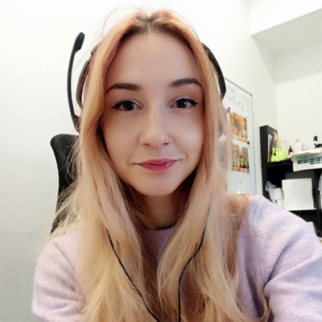
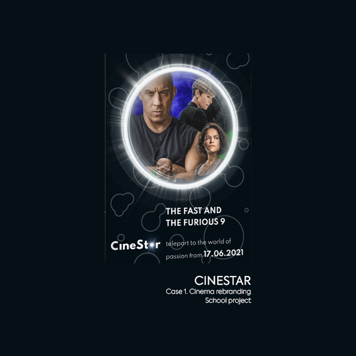
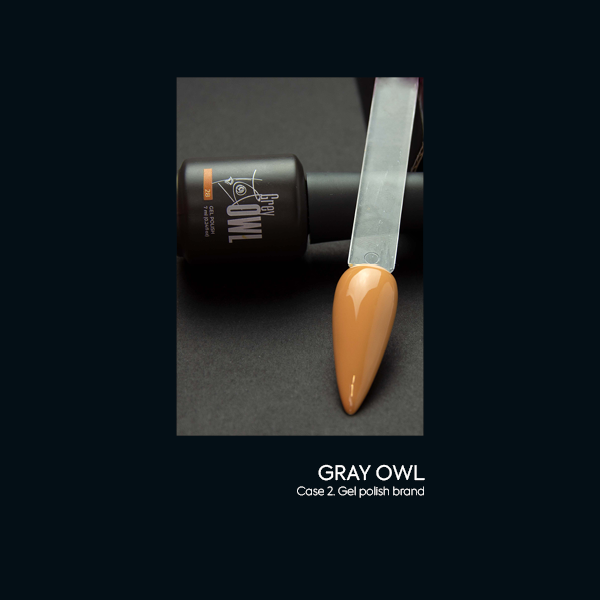

# Anastasiia Lunova

## About Me
A ~~markesigner~~ brand designer who cares about marketing.

## My Story

[__who:__] Hello! I'm Anastasiia. Nice to meet you!

[__where:__] Currently based in Prague, Czech Republic, but originally from brave Ukraine ✌

[__work:__] In my work I like to combine design, marketing, and psychology. Each brand is a living entity for me, with its own character, features, voice, and behavior. 

 [__experience:__] Human-Computer Interaction course, 4 years in marketing, Graphic Design student.

[__also:__] Also, I'm a gamer...board games gamer 😊 Apart from my work and study, I enjoy traveling, dancing, reading and, it seems, figure skating (but so far I have only skated twice 😏)

## Featured Project

### #01. Rebranding of the cinema CineStar

- The purpose of this project was to unify and modernize the corporate identity of the cinema chain.
- A new visual style increases the interest of the audience and attracts new customers.

[View the Case Study #1](case-study-01.md)

### #02. GRAY OWL, gel polish brand

- Creating a brand of gel polishes for sale on marketplaces.
- Result: the idea and mood of the brand, logo, packaging in an unusual style for marketplaces, and photos.

[View the Case Study #2](case-study-02.md)

