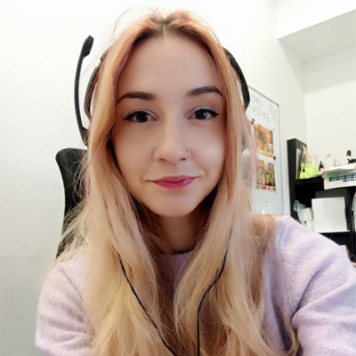

Hi, I’m Anastasiia Lunova

I’m a curious and open-minded person who loves designing brands and getting new experiences.

## Experience

**Freelance Graphic Designer**
2021 | present
My specialization is brand identity and visual communication.

**Marketing Manager**
2019.10 | present
E.Mi - International, Prague, Czech Republic
- market analysis 
- emerging opportunities definition
- drawing up algorithms for new products launching
- promotional strategy development

**Junior Marketing Manager**
2018.10 | 2019.10
E.Mi - International, Prague, Czech Republic
- organization a company participation in the Professional Beauty London exhibition
- management of corporate events (in Spain, UK, Israel, Russia, Czech Republic)
- backstage coordination at London Fashion Week 2019
- organization of International Congress: program preparation, event moderation

**Assistant in Marketing Department**
2018.05 | 2018.10
E.Mi – International s.r.o., Prague, Czech Republic
- POS-materials development
- creation of a competitor database
- creation and moderation of database of all brand and products materials for distributors

## Education

2020 | present
**University of Creative Communication, Prague**
Faculty of Visual Creation,
Graphic and Media Design 

2019
**Graphic Design & Painting Training**

2013 | 2017
**Czech Technical University, Prague**
Faculty of Electrical Engineering,
Software Technologies and Management,
Web & Multimedia; Software Engineering

## Skills

**Soft skills:**
- Fast learner
- Creative
- Multitasking
- Analytical skills
- Strategic mindset

**Hard skills:**
- Adobe Indesign
- Adobe Illustrator
- Adobe Photoshop
- Adobe Xd
- Figma
- Tilda

**Languages:**
- Ukrainian (Native)
- English (Intermediate)
- Czech (Intermediate)
- Russian (Native)

______

- [Download CV (PDF)](cv-2022-12-Lunova.pdf)
