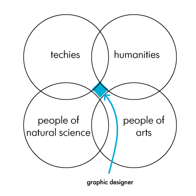

# Who a Graphic Designer Actually Is?

### by Anastasiia Lunova

Initially, I was going to talk about a completely different topic: _How Graphic Design Impacts Society_. But while my working on this subject, I stumbled upon a thought that maybe concerns other colleagues as well. 

Sometimes I fill that some people around misunderstand and underestimate the Graphic Design. They consider it as something that takes 2-3 monthes of online course and voilà.
Of course, I find this situation unfair! But honestly, who we are and what is our place among other professions?

* Is a graphic designer a marketer who knows how to draw?
* Is it an artist who was not accepted into the Academy of Fine Arts (because he was not "fine" enough)? 
* Or is it someone who mechanically moves pictures around, waiting for them to become some kind of beautiful image?

**Look**, there are four clearly defined inclinations in professional orientation: techies, humanities, people of natural sciences, and people of arts. 

And you know what I think? I think that a graphic designer is right here!

