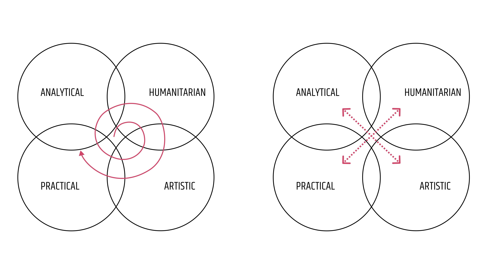
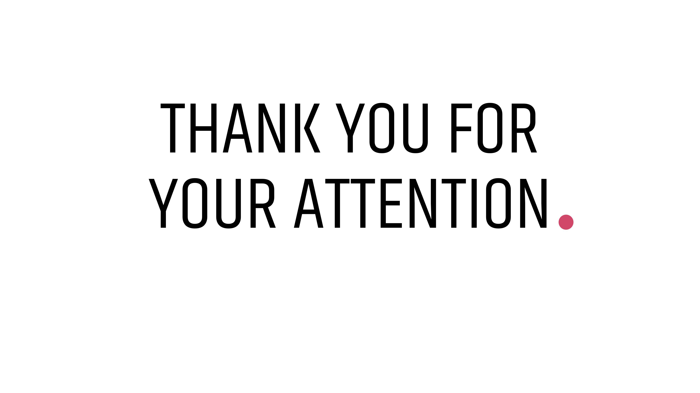

# Who a Graphic Designer Actually Is?

### by Anastasiia Lunova

Initially, I was going to discuss a completely different topic: "How Graphic Design Impacts Society". However, while working on this subject, I had a thought that may be relevant to those present as well. Sometimes I feel that some people misunderstand and underestimate Graphic Design. They see it as something that can be learned in a 2-3 month online course, and that's it. I find this situation unfair! Here are some options that some people may think:

• Graphic designers are marketers who know how to draw;
• They are artists who were not accepted into the Academy of Fine Arts (because they were not "fine" enough);
• They are people who mechanically move pictures around, waiting for them to become some kind of beautiful image.

So, who are we, and what is our place among other professions?

Most well-developed career assessment tests try to determine a person's thinking style and use it as a basis for providing career advice. There are such types of thinking:

•	**Analytical**: People with this type of thinking style are rational, detail-oriented, and methodical. They are good at mathematics, logic, and abstract concepts.
•	**Humanitarian**: People with this type of thinking style are empathetic, able to find common ground with others, and understand other points of view. They are interested in psychology and literature and have an aptitude for foreign languages, history, and social studies. They work well with texts and people.
•	**Practical**: People with this type of thinking style can find practical applications for everything around them. They quickly adapt to changing conditions and enjoy working with their hands, creating or fixing things.
•	**Artistic-imaginative**: People with this type of thinking style have developed imagination and creative abilities. They often have a passion for drawing, singing, and dancing.

And do you know what I think? I think that a graphic designer is right here!

Let me explain. 

Once upon a time, there was a girl.

From the childhood she has been interested in arts. All her hobbies revolved around drawing, dancing, and acting. She chose the secondary school with a focus on arts. But when she went to galleries, workshops, or lectures, she had a feeling her thinking was not artistic enough. Or that the thinking is not _just_ artistic. The true art was too non-practical for her to want to do it. And she desided to try something else.

Some time later she went here.

Absolving of 7 types of mathematics, different approaches to programming, few programming languages… After graduating high school, she had a feeling her thinking is not analytical enough. And she quit. To start almost from scratch.

With no experience and no education in the field, she came to marketing. 

So what. In three years it will change anyway (spoiler).
Soft skills, communication skills, understanding people's behaviour, and psychology in some way – it turns out she was interested in that too. And because she quickly grew from an assistant to a marketing manager, it seemed that she did quite well. 
But. Day-to-day communication with people, thinking about selling tricks and customers' expectations … oh, briefly speaking she felt her thinking is not humanitarian enough. And she quit. This time she has known where (circumstances at work seemed to push her there). To start almost from scratch.

And now she is here, studying graphic design at the High School of Creative Communication.

This story was told in a specific way. Now, you probably think that I am leading to the fact that all the stupid phrases from the beginning of the presentation are true. They are not.

Exactly because of my path (sorry, the path of this hypothetical heroine) went the way it did, I can say something. Graphic design definitely has features from all the fields that have been named. Definitely. And now it’s time to return to the list of types of thinking. I left out another one. **Universal**.

People with this type of thinking can realize themselves in any field — from programming to poetry, — psychologists say. They succeed in almost everything they undertake. Their negative side is that they quickly get bored with the routine. If you are this type, most likely you have a lot of different hobbies. Your interests may include sports, creativity, exact sciences, literature, politics, economics. This type of thinking is suitable for such professions as: project manager, entrepreneur, director, designer of any direction.
It's not so bad to be in such a rare group, right?

So, yeh, maybe graphic designers stand apart from other groups, or maybe they are the coolest guys in the tiny intersection — you can think whatever you want. As for me, it depends on my mood.
But the main point remains the same: each of you are a very special combination of gifts and skills, and you are responsible for developing them.

Whatever strategy you choose - to develop as a spiral, taking a little from each area and expanding your spiral more and more, or to choose a narrow direction and improve in it - accept yourself. 

Keep your mind open, look around, and think widely. Do what you enjoy right now, and don't worry if your preferences change the next day. It's okay. This is your journey to getting to know yourself.

To see the presentation, please, [click here](images/06-storytelling.pdf).

