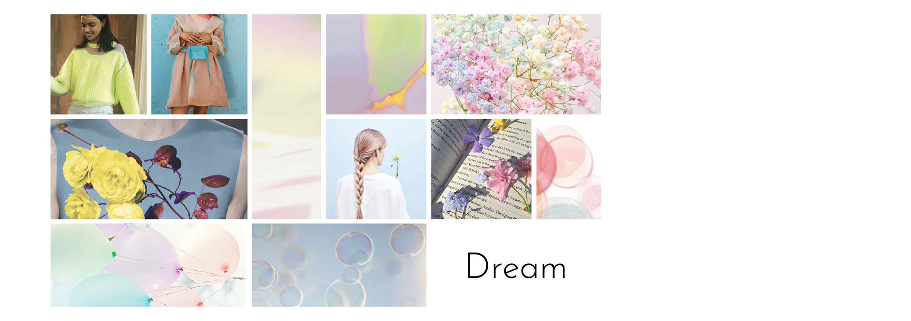
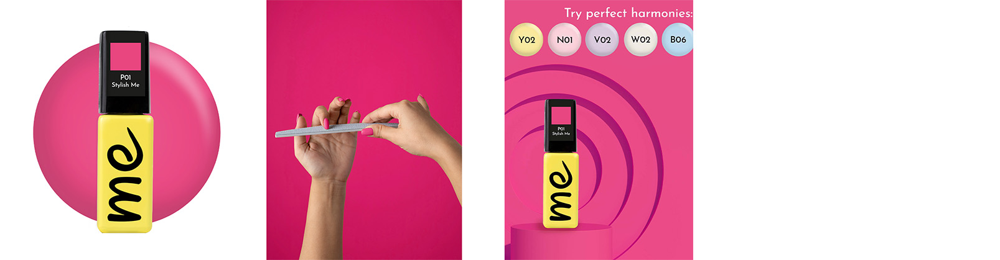

# Thesis presentation
# Visual Identity of a Cosmetic Brand

## Table of contents
* [The Background of the Topic and Aim](#The-Background-of-the-Topic-and-Aim)
* [Main Brand Analysis](#Main-Brand-Analysis)
* [Competitive Environment Analysis](#Competitive-Environment-Analysis)
* [Brand Identity Development](#Brand-Identity-Development)
  - [Moodboard](#Moodboard)
  - [Brand Name](#Brand-Name)
  - [Logo](#Logo)
  - [Color Palette](#Color-Palette)
  - [Font](#Font)
  - [Mission](#Mission)
  - [Values](#Values)
  - [Tone & Voice](#Tone-&-Voice)
* [Packaging](#Packaging)
* [POS materials](#POS-materials)
* [Communication on Digital Platfrom](#Communication-on-Digital-Platfrom)

## The Background of the Topic and Aim

**The Topic:** creating a brand of gel polishes, which will fulfil the role of an Endorsed Brand of an already existing premium brand.

**The Motive:** the forecast of the company's analysts regarding the customer churn. 
The current brand cooperates with category A salons and is located in a higher price category on the market. The company's response to the current economic situation and world trends is the decision to offer a more affordable alternative.
1) maintaining the reputation of the brand and the quality of the products;
2) the possibility of focusing on a wider target group (salons of category B and B+);
3) the possibility of gradual transition of new customers to the main brand in the future.

*The Aim:* creating a visual identity and communication style of the new brand.

## Main Brand Analysis


The EMI logo consists of three letters written in contrasting serif font, featuring a modern and minimalist design with clear lines and shapes for enhanced readability and easy zooming.
The chosen fonts for EMI present a limitation as they are not suitable for languages with diacritics, disregarding the international representation of the company. The bottle layout incorporates sharp shapes and wide lines, creating a unique visual style while maintaining some resemblance to the parent brand, allowing for necessary brand connection without direct copying.
EMI's brand positioning focuses on design and fashion, offering trendy gel nail shades, special decorations, and nail art techniques, while maintaining a reputation for excellence and high-quality products in the professional nail cosmetics industry.

## Competitive Environment Analysis


The conclusion is that the visual style of gel polish bottles on the market is very similar. The bottles have a similar shape, color, and composition. To differentiate from the competition, using different colors and design compositions can be effective. Despite the fact that most considered brands have a similar positioning, it should be noted that strong and consistent branding is rare. Due to high competition, creating a unique visual and communication style for the brand can be a crucial competitive advantage and an effective way to attract consumer attention.

## Brand Identity Development
The inspiration for the future development of the brand concept came, surprisingly, from limitations. More specifically, the word that became its antithesis after careful consideration — **a dream**. The dream stands in opposition to the depressive state created by the current economic environment and forecasts.

### Moodboard



The brand concept based on the platform of dreams reflects the effort to create a space for creative freedom and lightness. Building such branding is like creating a different world - a world that everyone would like to enter. It offers possibilities for experimentation, freedom, simplicity, and a touch of playfulness. The lower price supports this idea as it reduces the level of concerns among nail specialists when trying new products and transitioning to a new material. Ultimately, the concept of this brand offers a sense of unlimited possibilities that unfold when one dares to dream.

### Brand Name

The brand name should reflect its concept and values and should be easily memorable. In this work, after the brainstorming phase, the name **ME** was chosen. It has multiple meanings, making it a layered and interesting solution.
Firstly, it means "I" directly appealing to the inner aspirations of nail technicians who will be using the brand's gel polishes. Secondly, such a name has a playful touch, reflecting the concept associated with creative freedom and liberation from concerns during the interaction with this product. Moreover, it opens the path to creating a specific style of communication through wordplay and conceptual associations related to the brand's name.

### Logo


The brand logo is designed in the form of the brand name with an extended line at the end, creating the effect of presence after a just completed drawing process. The main objective in creating the logo was for it to look light and simple, without being overloaded with details. It was meant to be more like a mere stroke rather than a drawing. Additionally, ease of perception and readability at different scales were taken into account during the development process.

### Color Palette

The color palette aims to reflect the brand concept and shape the desired perception among the audience. When selecting the color scheme, it was important to immediately choose colors in the Pantone system, as they will be used for coloring the product bottles. Suppliers are more likely to match the shade accurately if they are provided with information in the values of this model.


PANTONE 13-2806 TCX is a delicate shade symbolizing "pink dreams". This reflects the idea of appealing to the individuality of the nail technician using the brand's gel polishes. 
PANTONE 13-4910 TCX is a fresh mint color that brings lightness to the palette and reflects the inspiring character of the brand's products. 
PANTONE 12-0646 TCX is a vibrant yellow that represents creativity and energy, as well as joy and optimism. This reflects the importance of creative freedom and liberation from worries during the interaction with the products. 
PANTONE 13-3507 TCX is a lavender shade that adds style and balances the palette.

### Font

When selecting a font for the ME brand, it was important to consider the international representation that the company-client relies on. The first criterion was the presence of diacritics. Another decisive factor was the availability of font variations to ensure flexibility in material creation. Finally, the font should have a sense of lightness and playfulness to reflect the brand's concept.

In this way, the Josefin Sans font was chosen, which meets all the specified requirements. This font has a subtle elegance while embodying the described mood. The font family includes 14 styles ranging from ExtraLight to Bold.


### Mission

Based on the developed concept and spirit of the brand, its mission has been derived, which is the answer to the questions "why does the brand exist" and "how does it aim to help customers or the company as a whole." The mission of the ME brand is as follows:

_**To create a sense of ease and unlimited possibilities on the way to your dream.**_

### Values

• Freedom and lightness,
• Creative freedom,
• Openness to dreams and the desire to make them come true,
• Experiments,
• Development and the desire for new heights,
• Professionalism and love for the craft.

### Tone & Voice

• **Tone:** Light, fresh, and optimistic. It tends towards an informal style rather than a formal one.
• **Voice:** Emotive, energetic, friendly. The company appeals to the audience by emphasizing personal feelings and qualities. It instills confidence and enthusiasm. The brand creates an atmosphere where every client and their desires matter.

The example:
_Are you looking for a guaranteed high-quality and easy-to-apply gel polish? Hello, it’s ME! Let your new gel polish give you a sense of easy and unlimited possibilities on the way to your dream! Feel free to experiment and trying something new — we stand for quality and standards. ME is the choice of ambitious dreamers._

• **Brand Language:**

Vocabulary: using understandable and clear vocabulary to communicate with the audience;
Formulation: using short sentences that are easily memorable and readable in time-limited situations;
Wordplay: using wordplay that relates to the brand name;
Personalized approach: each shade can be presented with a unique
description that reflects its individual character and the character of the person who chooses it.

The example:
_Get ready to soak up the sun in style with ME! Our vibrant hues and playful patterns will have you feeling confident and carefree, whether you’re lounging by the pool or exploring a new city. With ME, you can always be your most authentic self. So why settle for anything less? Let ME help you make this summer your most stylish yet!_


**As a greeting** in printed materials, videos, or posts, it is recommended to use a phrase that will be repeated again and again, thus fixing it in the customer’s memory for the brand. Such a phrase is: “Hello! It’s ME!”.
**The last sentence in business communication:** the sentence that will be used at the end of materials related to promotional offers, thus creating the desired message. It reads: “You and ME will be a great team!”.

## Packaging


All shade names will incorporate two letters from the brand name, “ME” as a standalone pronoun or part of a word. The shade numbering system will also align with another pillar of the ME brand — simplicity. This includes simplifying perception so that nothing distracts from the passion for the process and the pursuit of one's dream. Using numbers alone for shade identification could be confused with EMI gel polishes. Additionally, large numbers are less memorable for customers as they have no direct association with the color itself. Therefore, the ME shade numbering system will consist of a letter representing the color group (e.g., Y for yellow, R for red, B for blue, etc.) and a digit indicating the sequence number within that group.


## POS materials


## Communication on Digital Platfrom
The icons set:


The example og Instagram communication:


The example of the set of images for e-shop:


The example of the set of images for marketplaces:


Thank you for your attention!
```[Click to see the full presentation](images/08-thesis-presentation.pdf)
